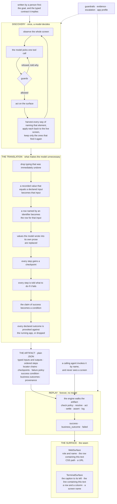

# Design write-up

## 1. Architecture

One seam splits the whole system. **Discovery is expensive, uncertain, and
happens once. Replay is cheap, deterministic, and happens forever.**

The same drawing is at
[excalidraw.com](https://excalidraw.com/#json=Wg5kkh_EieBgmpXVEqtWZ,Ch1wFCB3P-OmAA8wDy9jjQ),
and in `architecture.excalidraw` in this repository.

Five decisions do most of the work.

**The engine interprets an artifact, it does not run generated code.** It walks
the steps and dispatches on a fixed set of verbs. I could have had the model
write Python instead. Then nobody could read it, diff it, or approve it before
it ran unattended against member records. JSON you can read.

**One set of verbs, three users of it.** The same `Action` enum is the tool list
the model gets, the step types an artifact may hold, and the engine's dispatch
table. Nothing gets translated in between. There is no `click`, because a
terminal has no mouse. The verb is `activate`.

**The model's locator gets binned.** The model says "the link named MEMBER
INQUIRY" and that finds the element once, now. Then `describe_target` works out
every other way to name that element, tries each one against the live page, and
keeps only the ones that land on the same element. What the model picked is
evidence. What the page can prove is the capability.

**The engine always returns something.** `run()` gives back a `ReplayResult` for
any input and never raises. The caller is an agent, not a person watching a
terminal, and a stack trace is not one of the three shapes it knows.

**What is true of the product lives in an app profile, not in artifacts.**
Sign-on, and the screens that mean "session expired" or "not authorised", belong
to the vendor's product, not to any one flow. Fix one of those and every
capability gets the fix.

What I gave up: one process, synchronous, files on disk. Queues and databases
would be infrastructure the brief does not ask for, and the places they would
slot in are already visible, at the event sink and the handoff broker.

## 2. Artifact schema

An artifact is a **contract**, not a list of steps. An agent has to work out
whether it answers the task in front of it, and a step list tells it nothing.

- **Typed inputs**, each with a regex the value must match in full, a
  sensitivity tag, and a `unique_key` flag. A capability tiered
  `irreversible_write` will not construct unless one of its inputs is a unique
  key. Acting on a surname means acting on the wrong person sooner or later. A
  validator enforces that, not a comment.
- **Typed outputs**, coerced on the way out. Money is `Decimal`, never `float`.
- **An ordered step list**, every step carrying a plain-English `intent` written
  for a reviewer, and a `checkpoint` asserting it actually arrived.
- **A locator chain per target**, ordered best first: accessible role and name,
  label, placeholder, text, a scoped DOM path, grid coordinates, pixels. Replay
  records which one fired.
- **A success condition** asserted once at the end, distinct from the per-step
  checkpoints, because every step can pass while the screen shows the wrong
  record.
- **Declared business outcomes**, each with a detector confirmed against the
  running application.
- **Provenance**, naming the goal, the model, the run, and the institution it was
  recorded against. It points at the transcript and never embeds it.
- **Approval status and risk tier**, which the guardrails read.

Three layers were designed for and one is implemented: app profile (per vendor
product), capability (per flow), institution override (per tenant).

## 3. Determinism and error handling

**Determinism** comes from the locator chain and from polling. Every way of
naming an element was checked against the live page when it was recorded, so a
fallback is something that has actually worked, not a guess. `resolve` retries
the whole chain until a deadline, because a screen that is still loading looks
exactly like one that is missing the control. Scopes resolve to the **innermost**
match. Nested tables make the ancestors match too, and taking the first one
quietly reads a different member's row.

**A locator can be bound to a parameter.** Scopes are normally recorded as
plain text. If that text identifies one record, the compiler turns it into a
parameter, so the step reads "the `SELECT` link in the row holding
`{member_number}`" instead of the row it happened to see while recording. Four
members share the surname `VANCE`, and two of them share a first name, a branch
and a status, so on the results screen nothing else tells them apart.

I kept the rule narrow. A *container* can be named by an input marked
`unique_key`. A *control* can never be named by any value the run touched.

**Some answers have no message.** A member with no savings account gets a
profile with no savings row on it. The application says nothing. That is still
the caller's answer, not a fault, so `element_absent` is in the condition
vocabulary.

It only becomes a detector after a second run shows the same element present
under normal inputs. That is what separates "missing for this input" from "the
locator is broken", and without it every future breakage would come back as a
cheerful business outcome. It is also tied to the step that went looking,
because "there is no savings row" is just as true of the sign-on screen.

**Drift shows up on success, not on failure.** Every time something resolves,
the engine compares the way that fired against the way that was recorded. A
capability falling back to a weaker locator still works, but it is rotting, and
that lands on the result before it ever breaks.

**The result is one of three shapes**, never a boolean:

| Shape | Meaning | Example |
|---|---|---|
| `success` | the goal was reached | the balance, typed |
| `business_outcome` | a legitimate answer that is not success | `MEMBER_NOT_FOUND` |
| `failed` | something the caller must debug | `app_error`, with what step, expected, observed |

Underneath, thirteen failure classes. Every one that the fixture can provoke has
been made to fire:

| Condition | Reported as |
|---|---|
| a member that does not exist | `business_outcome MEMBER_NOT_FOUND` |
| a surname nobody on file has | `business_outcome NO_MEMBER_WITH_SURNAME` |
| a member holding no savings account | `business_outcome NO_SAVINGS_ACCOUNT` |
| a deposit below the product minimum | `business_outcome INVALID_DEPOSIT_AMOUNT` |
| a malformed member number | `failed input_invalid`, before any step runs |
| a one-off maintenance notice | `success`, with `dismissed_interstitial` recorded |
| a notice that will not clear | `failed`, after three attempts, saying so |
| the session timing out mid-flow | `success`, with `reauthenticated` recorded |
| the product's own error screen | `failed app_error` |
| an operator without the privilege | `failed permission_denied` |
| a route outside the allowlist | `failed policy_blocked` |
| an irreversible step nobody authorised | `failed escalation_unanswered` |

Recovery is bounded, and it knows what the flow is. Signing in again gets the
session back but not the place in the flow. So a **read-only** capability starts
again from step one, and a writing one stops. Replaying a submit could open a
second account.

## 4. Heterogeneity and multi-tenant

**Surface abstraction.** `Surface` is an abstract class that holds the policy.
Two subclasses hold the mechanism. The base class decides the order locators are
tried, what counts as drift, how long to wait, and when a screen has settled.
The subclass implements locate, act and observe. The engine imports `Surface`
and never Playwright, and says nothing about browsers or a DOM anywhere.

I built the second surface rather than just claiming the first one generalised.
It is a 24x80 character screen with no markup, no roles and no accessibility
tree, where the only address anything has is where it sits. The same engine
replays against it with no changes: the app profile says `surface_kind` and the
provider is built from that.

| Web | Character screen |
|---|---|
| role and accessible name | the caption to the left of a value |
| the row containing this text | the screen line containing this text |
| CSS path, then coordinates | `grid`, a row and a column |
| a URL, judged by the allowlist | a screen name, judged by the same allowlist |

The chain behaves the same way on both. Renaming a caption on the green screen
makes the `label` strategy miss, `grid` fires instead, and the result reports a
degradation: the capability still works and is decaying, which is exactly what
it reports on the web.

Building it found one real leak. The engine composed addresses with `urljoin`, a
web habit, which blocked the first terminal run at its own allowlist. Address
composition belongs to the surface now. That is the payoff for actually writing
the second one. The corner was there the whole time and no amount of thinking
about the design had found it.

Discovery runs on both. The verbs are the same, because they are the same verbs
the artifact and the engine use. The only difference is how a model is taught to
see the screen and point at things, so the surface owns that too: a short
perception brief, the words it may point with, and the sentence that corrects it
when it points one column too far. The model drove the green screen to the goal,
the compiler produced the capability, and both declared outcomes were confirmed
against the running app.

On the web I read the accessibility tree rather than the DOM, because desktop
platforms have an accessibility tree and do not have a DOM.

**Multi-tenant.** The fixture serves two institutions running the same product
at different versions, with different wording: `MEMBER ID` against
`ACCOUNT NUMBER`, `Search` against `Find`, `SAVINGS` against `REGULAR SHARES`.
The plan is three layers merged when the artifact loads: the app profile for
what is true of the product, the artifact for the flow, and an institution
override that patches only what a tenant renamed. Drift between tenants shows up
as degradation counts when you replay an artifact against a tenant it was not
recorded on, and that is the signal to write an override.

The override layer is designed, the directory is there, and it is not built.
That is a cut, not an oversight.

## 5. Escalation and handoff

"Stuck" is detected three ways: a step whose declared policy is `escalate`, a
step marked irreversible when confirmation is required, and a recognised screen
the profile cannot recover from.

The handoff is real, not described. The engine **stops driving the browser it
already has**. Nothing gets closed, nothing gets recreated, so the operator is
in the same session with the same cookies looking at the same screen. A request
is written out carrying the capability, the goal, the step, why it stopped, a
screenshot, and the accessibility tree of every frame. A small operator surface
shows it and takes the answer. The transfers land on the result as
`ControlEvent`s saying who held the session and whether they changed anything,
then the run picks up where it left off.

The mechanism is two files in the run's evidence directory. That is on purpose:
the smallest thing that is genuinely real. It is also the seam. A queue, a
websocket or a proper co-browsing console replaces those two writes and the
engine never notices. The operator UI is a mock. The control-transfer model is
not.

## 6. Safety

**An explicit allowlist**, deny by default. Hosts, route patterns, action
types, and separate grants for irreversible actions and for running an unapproved
artifact unattended. No allowlist file means the system refuses to start. If I
got that wrong the system does not run, and if I got the other choice wrong the
system runs and does anything.

It checks where a step **landed**, not just where it was aimed. Checking only
`navigate` steps constrained nothing, because you reach the member page by
clicking a link. Checking only the top-level URL constrained nothing either,
because in a frameset the address bar never moves. Every live frame has to be
permitted.

**Risk is handled conservatively.** An irreversible capability is refused
unless the allowlist grants it. Only the step that actually commits is marked,
so the gate does not fire on every menu click. A person is asked before it
runs.

**Redaction happens at the persistence boundary**, not the computation boundary.
Inputs and outputs are masked on the way into the log according to their
sensitivity, with `redacted_fields` naming what was hidden so a reader cannot
mistake masked for empty. The result returned to the caller carries the real
values, because the caller asked for them. No locator is ever built from a value
the run supplied or read.

Masking is keyed by value, not by field, so a value carrying two tags takes the
stricter one. A sub-account number came through once tagged `pii` and once
tagged `internal`. Masking each field on its own tag left the second copy in the
clear right next to the masked first.

The same rule covers the discovery trace, which also throws away the raw text of
every screen it saw. Those screens hold other people's records and nothing here
can tell which parts of them matter.

**What this does not cover.**

The allowlist works on hosts and paths, so it cannot say "this operator may open
accounts below this amount".

Redaction leans on the contract's tags being right, and a model proposes those
tags. The one rule that does not lean on it is `unique_key`, which is always
treated as identifying, because a model choosing the wrong word should not
decide whether a member number gets logged.

Only values the run supplied or read can be masked. Another member's data
sitting on the same screen is not recognised at all. That is why the discovery
trace keeps no screen text whatsoever.

The model's own context is not redacted. It sees the screen, which is the whole
point of computer use, and a real deployment would need a masking layer in front
of it. The result handed back to the caller is not masked either, because the
caller asked for it, but the evidence directory keeps a copy of that result and
in production it should not.

## 7. Cuts

Left out on purpose. Each one sits at a seam that already exists.

- **The institution override layer.** Designed, directory is there, not merged
  at load time. The fixture already serves the second tenant to build against.
- **A real operator console.** The handoff is two files and a terminal prompt.
- **Multi-run stability scoring.** Every artifact carries a `stability` block
  and nothing ever updates it.
- **Unit tests.** `scripts/end_to_end.py` checks 23 flows end to end, but
  `pytest` still reports no tests. Those are different things and I am not going
  to call one the other.
- **Outcomes the model cannot provoke.** If a trigger does not produce the
  situation, the outcome is dropped rather than shipped as a detector that would
  never fire. So some real outcomes are missing rather than wrong.

What I would do next, in order. The institution override layer first, because it
is the claim the brief presses hardest on and the fixture is already built for
it. Then a desktop surface, since the seam is now shown to carry a second
implementation and desktop is the last of the three kinds the brief names. Then
stability scoring, because approval should be earned by evidence rather than
asserted.
